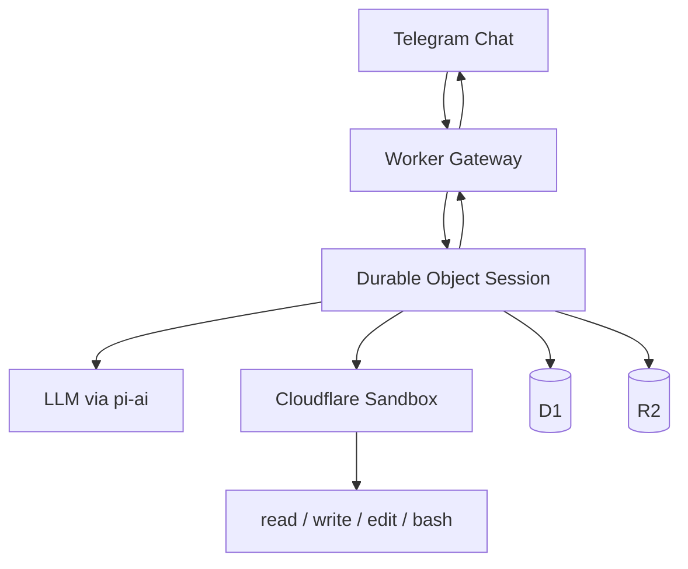

# dreclaw

`dreclaw` is my personal AI assistant project inspired by OpenClaw.
It is Cloudflare-first: Workers for control flow, Sandbox for OS-level execution, and pi-mono as the core agent stack.

## v0 Scope

- Telegram private chat-only, single-user (me)
- Tools: `read`, `write`, `edit`, `bash`
- Minimal surface: no guild mode, no extra tool wrappers

## Architecture (High-level)

`dreclaw` uses a split architecture: Cloudflare Workers run the agent control flow, and Cloudflare Sandbox runs OS-level execution.

- Worker verifies Discord requests and routes messages.
- Durable Object processes one turn at a time per session.
- Sandbox executes filesystem and CLI tasks via pi tools.
- D1 stores minimal session/run metadata; R2 stores larger artifacts.

## Setup

### Prereqs

- Cloudflare account
- Discord bot
- Node.js and Wrangler CLI

### Environment

Copy `.env.example` to `.env` and fill in values.

## Usage

- Message the bot in a private Telegram chat.
- `/status` shows runtime/session health.
- `/reset` clears current session context.

## Filesystem persistence

- Persistent runtime root is `/root/dreclaw`.
- It is synced to mounted storage at `/persist/dreclaw` between turns.

## Security

See `docs/security.md`.

## Future plans

- Discord `/model` selector
