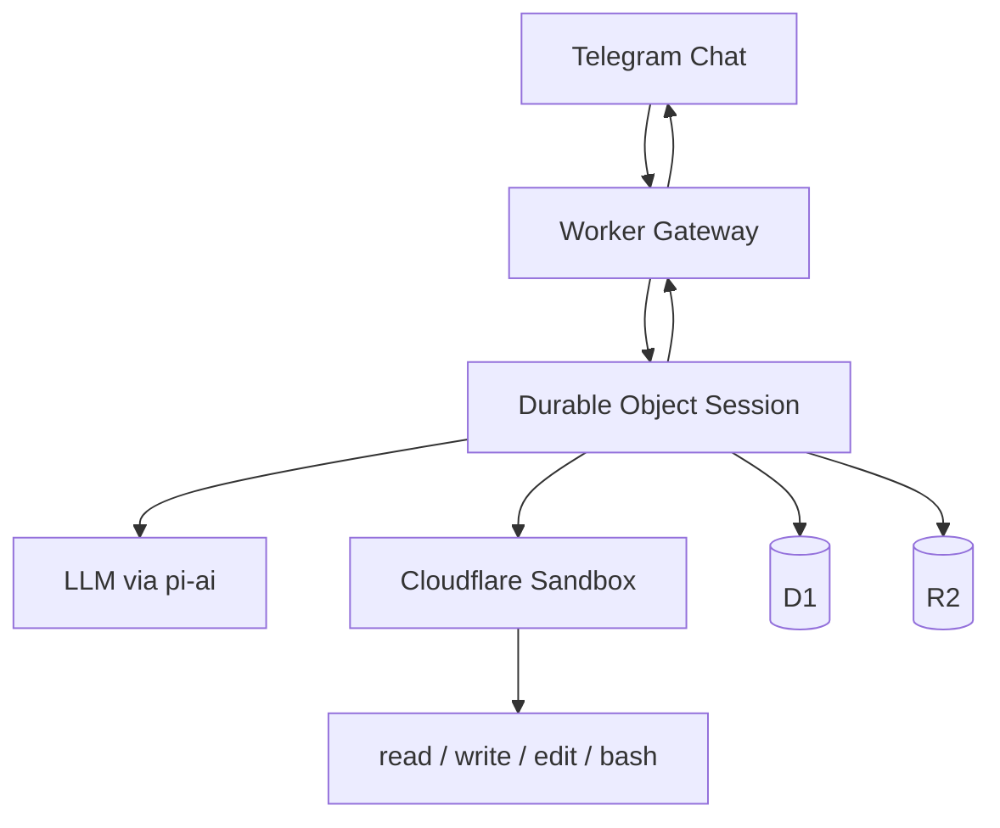

# dreclaw

`dreclaw` is my personal AI assistant project inspired by OpenClaw.
It is Cloudflare-first: Workers for control flow, Sandbox for OS-level execution, and pi-mono as the core agent stack.

## v0 Scope

- Telegram private chat-only, single-user (me)
- Tools: `read`, `write`, `edit`, `bash`
- Minimal surface: no guild mode, no extra tool wrappers

## Architecture (High-level)

`dreclaw` uses a split architecture: Cloudflare Workers run the agent control flow, and Cloudflare Sandbox runs OS-level execution.



- Worker verifies Telegram requests and routes messages.
- Durable Object processes one turn at a time per session.
- Sandbox executes filesystem and CLI tasks via pi tools.
- D1 stores minimal session/run metadata; R2 stores larger artifacts.

## Setup

### Prereqs

- Cloudflare account
- Telegram bot
- Node.js and pnpm
- Wrangler auth (`pnpm dlx wrangler whoami`)
- Docker running locally (required for container image deploy)

### Environment

Copy `.env.example` to `.env` and fill in values.

For `/persist` mount+sync, also set R2 S3 credentials in `.env`:

- `R2_ENDPOINT`
- `R2_ACCESS_KEY_ID`
- `R2_SECRET_ACCESS_KEY`

For model calls, either set:

- `OPENAI_API_KEY` (simple runtime key), or
- import OAuth credentials into Worker store with `/exec auth import <base64-json>`.

Provider auth is done inside sandbox (for example via `/exec pi-ai login <provider>`) and persisted under `/root/dreclaw`.

### Cloudflare resources

- Create D1 DB `dreclaw`
- Create R2 bucket `dreclaw-workspace`
- Put resulting IDs/names in `wrangler.toml`
- Apply migrations:

```bash
pnpm install
pnpm dlx wrangler d1 migrations apply DRECLAW_DB
```

### Deploy

Use route from `.env` (keeps route out of repo config):

```bash
set -a; source .env; set +a
pnpm dlx wrangler deploy --route "${CF_WORKER_ROUTE}"
```

### Test

```bash
pnpm test
pnpm check
```

## Usage

- Message the bot in a private Telegram chat.
- `/status` shows model/session/workspace/auth readiness from Worker credential store.
- `/reset` clears current session context.
- `/exec <command>` runs directly in Cloudflare Sandbox and returns command stdout/stderr.
- `/exec auth status` checks Worker credential-store readiness.
- `/exec auth import <base64-json>` imports owner OAuth credential payload.

## Filesystem persistence

- Persistent runtime root is `/root/dreclaw`.
- It is synced to mounted storage at `/persist/dreclaw` between turns.

## Security

See `docs/security.md`.

## Future plans

- Telegram `/model` selector
