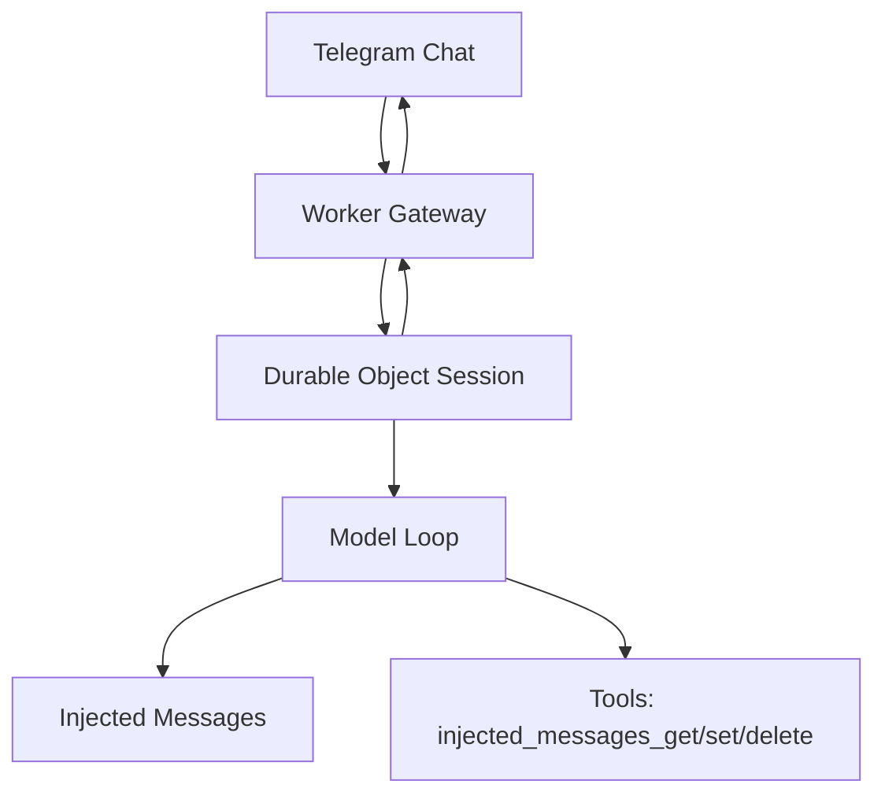

# dréclaw

`dréclaw` is a personal Cloudflare-first AI assistant inspired by OpenClaw.

## v0 Scope

- Telegram private chat-only, single-user (me)
- Commands: `/status`, `/reset`, `/details`, `/thinking`
- Core tools: `injected_messages_get`, `injected_messages_set`, `injected_messages_delete`
- Versioned `injected_messages` persisted in Durable Object session state
- OpenCode Zen provider (`MODEL` + `BASE_URL`)

## Architecture (High-level)



- Worker verifies Telegram requests and routes updates.
- Durable Object serializes turns and stores session state.
- Runtime injects:
  - `INJECTED_MESSAGES_START version=<n>`
  - current `injected_messages`
  - `INJECTED_MESSAGES_END`
- Agent can inspect/replace injected messages with versioned tools.

## Setup

### Prereqs

- Cloudflare account
- Telegram bot
- Node.js and Wrangler CLI

### Environment

Copy `.env.example` to `.env` and fill values.

Create local Wrangler config from template (not committed):

```bash
cp wrangler.toml.example wrangler.toml
```

Then set your own Cloudflare resource IDs in `wrangler.toml`.
Also set `route` in `wrangler.toml`.

Set Worker secret:

```bash
set -a; source .env; set +a
pnpm secrets:sync
```

This syncs all `.env` vars as Worker secrets (`TELEGRAM_*`, `OPENCODE_ZEN_API_KEY`, `MODEL`, `BASE_URL`).

### Deploy

Route is read from `wrangler.toml`:

```bash
pnpm deploy
```

## Usage

- Message the bot in a private Telegram chat.
- `/status` shows runtime/session/auth + injected message metadata.
- `/reset` clears conversation context only (keeps `injected_messages`).
- `/details compact|verbose|debug` controls tool/progress verbosity.
- `/thinking on|off` toggles thinking message visibility (shown in `debug` mode).

### Telegram message modes

- `compact` (default): typing indicator while work runs + final reply.
- `verbose`: compact behavior plus tool lifecycle updates (`Tool start`, `Tool ok/error`).
- `debug`: verbose behavior plus detailed tool call arguments/output and thinking snippets (if enabled).

## Testing

- Run full tests: `pnpm test`
- Type-check: `pnpm check`
- Run live model smoke test (real Zen + tool loop): `set -a; source .env; set +a && pnpm smoke:live -- --prompt "hey"`
- Run pre-deploy gate: `pnpm verify:predeploy`

## Persistence model

- Durable conversation history lives in session state.
- `injected_messages` live in session state with optimistic versioning.
- `injected_messages_set` upserts one message by `id` with `expected_version` checks.
- `injected_messages_delete` removes one message by `id` with `expected_version` checks.

## Auth model

- `OPENCODE_ZEN_API_KEY` is stored as Worker secret.
- `/status` reports readiness only (no secrets).

## Security

See `docs/security.md`.
