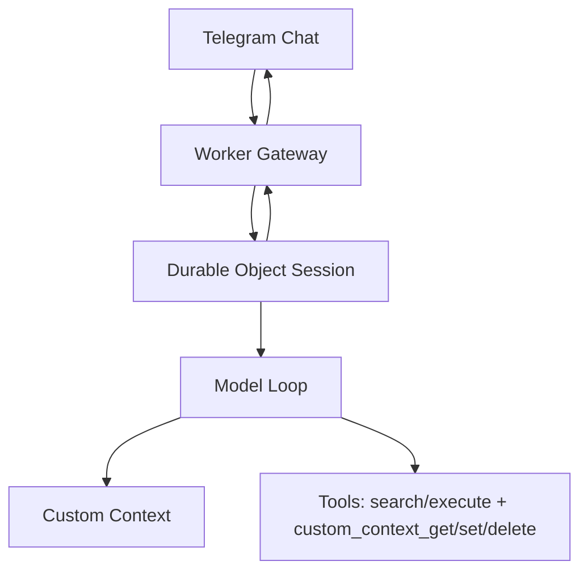

# dréclaw

`dréclaw` is a personal Cloudflare-first AI assistant inspired by OpenClaw.

## v0 Scope

- Telegram private chat-only, single-user (me)
- Commands: `/status`, `/reset`, `/factory-reset`, `/debug`, `/show-thinking`
- Core tools: `search`, `execute`, `custom_context_get`, `custom_context_set`, `custom_context_delete`
- Versioned `custom_context` persisted in Durable Object session state
- OpenCode Zen provider via AI SDK (`MODEL` + `BASE_URL`)

## Architecture (High-level)



- Worker verifies Telegram requests and routes updates.
- Durable Object serializes turns and stores session state.
- Runtime compiles `custom_context` into XML in the system prompt:
  - `<custom_context_manifest version="<n>" count="<m>">`
  - `<custom_context id="...">...</custom_context>` entries (sorted by id)
  - `</custom_context_manifest>`
- Agent loop runs on AI SDK `ToolLoopAgent` and can inspect/replace custom context with versioned tools.
- Agent can run sandboxed JS with `execute`; `search` lists runtime limits/capabilities and installed packages.

## Setup

### Prereqs

- Cloudflare account
- Telegram bot
- Node.js and Wrangler CLI

### Environment

Copy `.env.example` to `.env` and fill values.

Create local Wrangler config from template (not committed):

```bash
cp wrangler.toml.example wrangler.toml
```

Then set your own Cloudflare resource IDs in `wrangler.toml`.
Also set `route` in `wrangler.toml`.

Set Worker secret:

```bash
set -a; source .env; set +a
pnpm secrets:sync
```

This syncs all `.env` vars as Worker secrets (`TELEGRAM_*`, `OPENCODE_ZEN_API_KEY`, `MODEL`, `BASE_URL`).

### Deploy

Route is read from `wrangler.toml`:

```bash
pnpm deploy
```

## Usage

- Message the bot in a private Telegram chat.
- `/status` shows runtime/session/auth + custom context metadata.
- `/reset` clears conversation context only (keeps `custom_context`).
- `/factory-reset` clears conversation context and restores default `custom_context`.
- `/debug on|off` toggles tool/progress debug messages.
- `/show-thinking on|off` toggles thinking block visibility.

### Telegram message modes

- `compact` (default): typing indicator while work runs + final reply.
- `debug`: compact behavior plus tool call/result messages.

## Testing

- Run full tests: `pnpm test`
- Type-check: `pnpm check`
- Run live model smoke test (real Zen + tool loop): `set -a; source .env; set +a && pnpm smoke:live -- --prompt "hey"`
- Run pre-deploy gate: `pnpm verify:predeploy`

## Persistence model

- Durable conversation history lives in session state.
- `custom_context` lives in session state with optimistic versioning.
- `custom_context_set` upserts one context entry by `id` with `expected_version` checks.
- `custom_context_delete` removes one context entry by `id` with `expected_version` checks.
- `search` returns QuickJS runtime capabilities/limits and package inventory.
- `execute` runs JavaScript in QuickJS and exposes `pkg.install`, `pkg.list`, and `fetch` inside the runtime.

## Auth model

- `OPENCODE_ZEN_API_KEY` is stored as Worker secret.
- `/status` reports readiness only (no secrets).

## Security

See `docs/security.md`.
