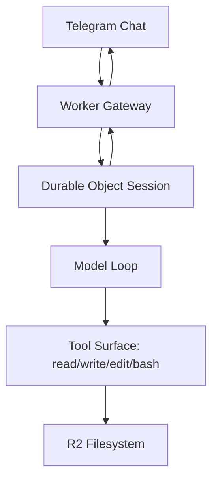

# dréclaw

`dréclaw` is my personal AI assistant, inspired by OpenClaw, built Cloudflare-first.

v0 is Worker-native: Telegram ingress, Durable Object session runtime, model/tool loop in Workers, and R2-backed persistence.

## v0 Scope

- Telegram private chat-only, single-user (me)
- Commands: `/status`, `/reset`, `/details`, `/thinking`
- Core tools: `read`, `write`, `edit`, `bash` (via just-bash)
- R2-backed filesystem for files and saved scripts
- OpenCode Zen provider (`MODEL` + `BASE_URL`)
- No Sandbox/container dependency in v0
- Telegram UX keeps a typing indicator active during runs, then sends final answer

## Architecture (High-level)



- Worker verifies Telegram requests and routes updates.
- Durable Object serializes turns.
- Agent loop runs via `@mariozechner/pi-agent-core` and drives tool calls.
- Files persist in R2.
- Auth is `OPENCODE_ZEN_API_KEY` Worker secret.

## Setup

### Prereqs

- Cloudflare account
- Telegram bot
- Node.js and Wrangler CLI

### Environment

Copy `.env.example` to `.env` and fill values.

Create local Wrangler config from template (not committed):

```bash
cp wrangler.toml.example wrangler.toml
```

Then set your own Cloudflare resource IDs in `wrangler.toml`.
Also set `route` in `wrangler.toml`.

Set Worker secret:

```bash
set -a; source .env; set +a
pnpm secrets:sync
```

This syncs all `.env` vars as Worker secrets (`TELEGRAM_*`, `OPENCODE_ZEN_API_KEY`, `MODEL`, `BASE_URL`).

### Deploy

Route is read from `wrangler.toml`:

```bash
pnpm deploy
```

Seed default memory templates in R2 (recommended right after deploy):

```bash
pnpm seed:memory
```

This creates `defaults/SOUL.md` and `defaults/MEMORY.md` (from `src/initial-filesystem/SOUL.md` and `src/initial-filesystem/MEMORY.md`) only when they do not already exist.
New session files use these defaults when `/SOUL.md` or `/MEMORY.md` is missing.

Or run deploy + seed in one step:

```bash
pnpm deploy:seed
```

## Usage

- Message the bot in a private Telegram chat.
- `/status` shows runtime/session/auth readiness.
- `/reset` clears current session context.
- `/details compact|verbose|debug` controls tool/progress verbosity.
- `/thinking on|off` toggles thinking message visibility (shown in `debug` mode).

### Telegram message modes

- `compact` (default): typing indicator while work runs + final reply.
- `verbose`: compact behavior plus tool lifecycle updates (`Tool start`, `Tool ok/error`).
- `debug`: verbose behavior plus detailed tool call arguments/output and thinking snippets (if enabled).

## Testing

- Run full tests: `pnpm test`
- Type-check: `pnpm check`
- Run live model smoke test (real Zen + tool loop): `set -a; source .env; set +a && pnpm smoke:live -- --prompt "hey"`
- Run pre-deploy gate: `pnpm verify:predeploy`
- Preferred local strategy is unit-first with webhook fixtures in `tests/fixtures/telegram`.
- Use `tests/unit/telegram-update-processor.test.ts` for behavior coverage.
- Keep e2e tests thin for route + header wiring in `tests/e2e/webhook.e2e.test.ts`.

## Persistence model

- Filesystem root of truth is R2.
- Identity is stored in `/SOUL.md`.
- Durable user memory is stored in `/MEMORY.md` (keep under 20 lines).
- Saved scripts are stored and run from R2.

## Auth model

- `OPENCODE_ZEN_API_KEY` is stored as Worker secret.
- `/status` reports readiness only (no secrets).

## Security

See `docs/security.md`.

## Future plans

- Telegram `/model` selector
- Semantic memory (AI Search / Vectorize)
- OpenClaw node compatibility layer (post-v0)
