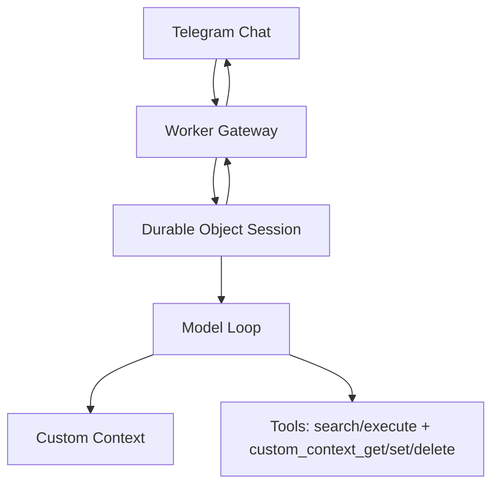

# dréclaw

`dréclaw` is a personal Cloudflare-first AI assistant inspired by OpenClaw.

## v0 Scope

- Telegram private chat-only, single-user (me)
- Commands: `/status`, `/reset`, `/factory-reset`, `/debug`, `/show-thinking`
- Core tools: `search`, `execute`, `custom_context_get`, `custom_context_set`, `custom_context_delete`
- Versioned `custom_context` persisted in Durable Object session state
- AI SDK provider switch: `opencode`, `opencode-go`, or `workers` (Workers AI)

## Architecture (High-level)


```mermaid
flowchart TD
  U[Telegram Chat] --> W[Worker Gateway]
  W --> DO[Durable Object Session]
  DO --> M[Model Loop]
  M --> CC[Custom Context]
  M --> T[Tools: search/execute + custom_context_get/set/delete]
  DO --> W --> U
```

- Worker verifies Telegram requests and routes updates.
- Durable Object serializes turns and stores session state.
- Runtime compiles `custom_context` into XML in the system prompt:
  - `<custom_context_manifest version="<n>" count="<m>">`
  - `<custom_context id="...">...</custom_context>` entries (sorted by id)
  - `</custom_context_manifest>`
- Agent loop runs on AI SDK `ToolLoopAgent` and can inspect/replace custom context with versioned tools.
- OpenCode uses `AI_PROVIDER=opencode` (Zen default URL) or `AI_PROVIDER=opencode-go` (Go default URL).
- Workers AI runs via `workers-ai-provider` binding (`env.AI`) when `AI_PROVIDER=workers`.
- Agent can run sandboxed JS with `execute`; `search` lists runtime limits/capabilities and installed packages.

## Setup

### Prereqs

- Cloudflare account
- Telegram bot
- Node.js and Wrangler CLI

### Environment

Copy `.env.example` to `.env` and fill values.

Create local Wrangler config from template (not committed):

```bash
cp wrangler.toml.example wrangler.toml
```

Then set your own Cloudflare resource IDs in `wrangler.toml`.
Also set `route` in `wrangler.toml`.

Set Worker secret:

```bash
set -a; source .env; set +a
pnpm secrets:sync
```

This syncs all `.env` vars as Worker secrets (`TELEGRAM_*`, `AI_PROVIDER`, `OPENCODE_API_KEY`, `GOOGLE_OAUTH_*`, `MODEL`, `BASE_URL`).

### Deploy

Route is read from `wrangler.toml`:

```bash
pnpm deploy
```

## Usage

- Message the bot in a private Telegram chat.
- `/status` shows runtime/session/auth + custom context metadata.
- `/reset` clears conversation context only (keeps `custom_context`).
- `/factory-reset` clears conversation context and restores default `custom_context`.
- `/debug on|off` toggles debug previews and per-step tool summaries.
- `/show-thinking on|off` toggles thinking block visibility.
- `/google connect` starts Google OAuth linking flow.
- `/google status` shows current Google link status and scopes.
- `/google disconnect` removes stored Google OAuth token.

### Telegram message modes

- `compact` (default): typing indicator while work runs + final reply.
- `debug`: compact behavior plus friendly tool previews and per-step summaries.

## Testing

- Run full tests: `pnpm test`
- Type-check: `pnpm check`
- Run live model smoke test (real OpenCode Go + tool loop): `set -a; source .env; set +a && pnpm smoke:live -- --prompt "hey"`
- Run pre-deploy gate: `pnpm verify:predeploy`

## Persistence model

- Durable conversation history lives in session state.
- `custom_context` lives in session state with optimistic versioning.
- `custom_context_set` upserts one context entry by `id` with `expected_version` checks.
- `custom_context_delete` removes one context entry by `id` with `expected_version` checks.
- `search` returns QuickJS runtime capabilities/limits and package inventory.
- `execute` runs JavaScript in QuickJS and exposes `pkg.install`, `pkg.list`, and `fetch` inside the runtime.
- `execute` also exposes `google.api(service, version)`, `google.schema(service, version, method)`, and `google.execute({...})`.

### Google OAuth setup

- Configure Google OAuth app as **Web application** in Google Cloud Console.
- Add redirect URI: `https://<worker-host>/google/oauth/callback`.
- Set `GOOGLE_OAUTH_*` values in `.env` and sync secrets.
- Recommended full-access scope set for this project: Gmail (`https://mail.google.com/`), Sheets (`https://www.googleapis.com/auth/spreadsheets`), Docs (`https://www.googleapis.com/auth/documents`), Calendar (`https://www.googleapis.com/auth/calendar`), Drive (`https://www.googleapis.com/auth/drive`).
- In Telegram, run `/google connect`, open link, approve scopes.

### Google execute examples

```js
const gmail = await google.api("gmail", "v1")
const messages = await gmail.users.messages.list({
  params: { userId: "me", maxResults: 5, q: "is:unread" },
})
messages
```

```js
const sheets = await google.api("sheets", "v4")
await sheets.spreadsheets.values.update({
  params: {
    spreadsheetId: input.sheetId,
    range: "Sheet1!A1:B2",
    valueInputOption: "RAW",
  },
  body: { values: [["name", "value"], ["demo", "1"]] },
})
```

## Auth model

- `OPENCODE_API_KEY` is stored as Worker secret.
- `/status` reports readiness only (no secrets).

## Security

See `docs/security.md`.
