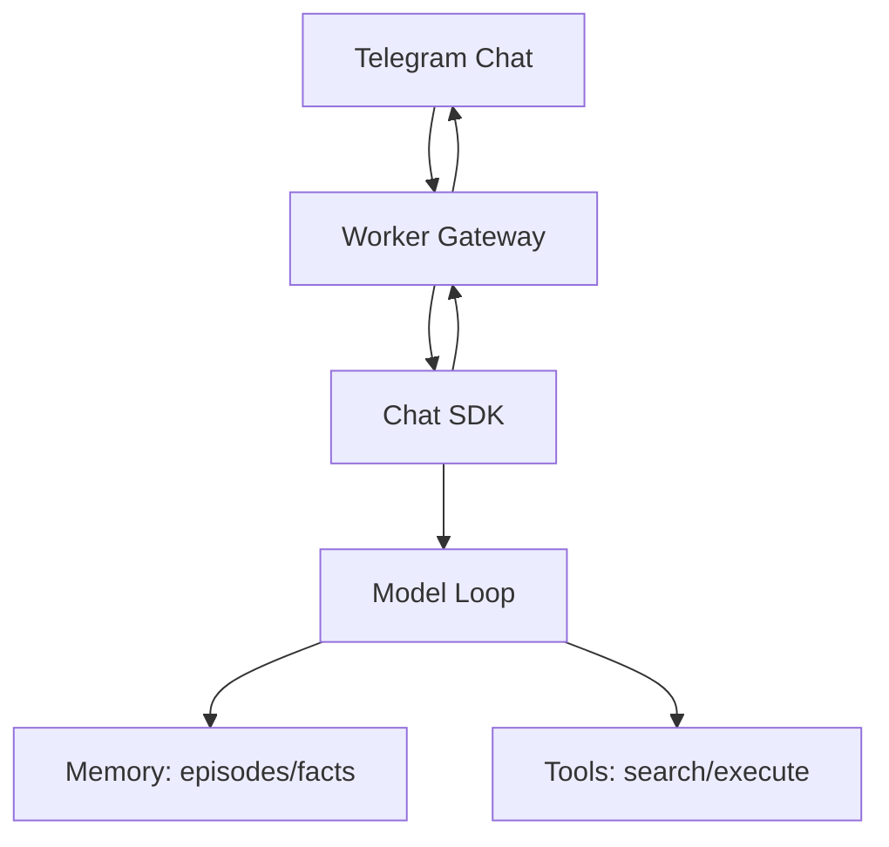

# dréclaw

`dréclaw` is a personal Cloudflare-first Telegram AI assistant.

## v0 Scope

- Telegram private chat-only, single-user (me)
- Chat SDK + Telegram adapter runtime
- Commands: `/help`, `/status`, `/reset`, `/factory-reset`, `/verbose`, `/google ...`
- Core tools: `search`, `execute`
- Persistent memory: D1 episodic/fact memory + Vectorize semantic recall
- Hybrid memory pipeline: D1 episodic/fact memory + Vectorize semantic recall (Workers AI embeddings)
- AI SDK provider switch: `opencode`, `opencode-go`, or `workers` (Workers AI)

## Architecture (High-level)


```mermaid
flowchart TD
  U[Telegram Chat] --> W[Worker Gateway]
  W --> C[Chat SDK]
  C --> M[Model Loop]
  M --> MM[Memory: episodes/facts]
  M --> T[Tools: search/execute]
  C --> W --> U
```

- Worker routes Telegram webhooks into Chat SDK.
- Chat SDK handles Telegram transport, subscriptions, streaming, and locking via a D1-backed state adapter.
- Runtime retrieves memory context (hybrid semantic + lexical + recency) and injects it into the system prompt.
- Agent loop runs on AI SDK `ToolLoopAgent` with runtime-managed memory persistence.
- OpenCode uses `AI_PROVIDER=opencode` (Zen default URL) or `AI_PROVIDER=opencode-go` (Go default URL).
- Workers AI runs via `workers-ai-provider` binding (`env.AI`) when `AI_PROVIDER=workers`.
- Agent can run sandboxed JS with `execute`; `search` lists runtime limits/capabilities and installed packages.

## Setup

### Prereqs

- Cloudflare account
- Telegram bot
- Node.js and Wrangler CLI

### Environment

Copy `.env.example` to `.env` and fill values.

Create local Wrangler config from template (not committed):

```bash
cp wrangler.toml.example wrangler.toml
```

Then set your own Cloudflare resource IDs in `wrangler.toml`.
Also set `route` in `wrangler.toml`.

Set Worker secret:

```bash
set -a; source .env; set +a
pnpm secrets:sync
```

This syncs all `.env` vars as Worker secrets (`TELEGRAM_*`, `AI_PROVIDER`, `OPENCODE_API_KEY`, `GOOGLE_OAUTH_*`, `MODEL`, `BASE_URL`).

### Deploy

Route is read from `wrangler.toml`:

```bash
pnpm deploy
```

## Usage

- Message the bot in a private Telegram chat.
- `/help` lists commands.
- `/status` shows model/provider/memory/google/verbose status.
- `/reset` clears conversation context only (keeps memory).
- `/factory-reset` clears conversation, memory, runtime state, and VFS.
- `/verbose on|off` toggles tool traces, including execute code, writes, and result summaries.
- `/google connect` starts Google OAuth linking flow.
- `/google status` shows current Google link status and scopes.
- `/google disconnect` removes stored Google OAuth token.

Normal messages stream a single assistant reply.

## Testing

- Run full tests: `pnpm test`
- Type-check: `pnpm check`
- Run live model smoke test (real OpenCode Go + tool loop): `set -a; source .env; set +a && pnpm smoke:live -- --prompt "hey"`
- Run Telegram live test via GramJS: `pnpm live:telegram -- --prompt "hey"`
- Run pre-deploy gate: `pnpm verify:predeploy`

### Telegram live harness

- Uses a real Telegram user account via GramJS, not Telegram Web.
- Add local-only env vars: `TELEGRAM_TEST_API_ID`, `TELEGRAM_TEST_API_HASH`, `TELEGRAM_TEST_BOT_USERNAME`, `TELEGRAM_TEST_SESSION`.
- Get `TELEGRAM_TEST_API_ID` and `TELEGRAM_TEST_API_HASH` from `https://my.telegram.org/apps`.
- First-time login: `pnpm live:telegram -- --login` and save the printed session string into `.env` as `TELEGRAM_TEST_SESSION`.
- Keep these values local only; do not sync them as Worker secrets.

## Persistence model

- Conversation history and bot state live in Chat SDK thread state backed by D1.
- Long-term memory facts/episodes live in D1 + Vectorize (`VECTORIZE_MEMORY`) with Workers AI embeddings (`env.AI`).
- Memory writes are salience-gated and consolidated through reflection.
- `search` returns QuickJS runtime capabilities/limits and package inventory.
- `execute` runs JavaScript in QuickJS and exposes `pkg.install`, `pkg.list`, `fetch`, and `fs.read/fs.write/fs.list/fs.remove` inside the runtime.
- `execute` also exposes `memory.find(query, opts?)`, `memory.save(text, opts?)`, and `memory.remove(target)` for direct memory control.
- `execute` exposes `google.execute({...})` for Google API calls.
- `execute` can import saved modules via `vfs:/...` (for example `import { run } from "vfs:/scripts/run.js"`).

### Google OAuth setup

- Configure Google OAuth app as **Web application** in Google Cloud Console.
- Add redirect URI: `https://<worker-host>/google/oauth/callback`.
- Set `GOOGLE_OAUTH_*` values in `.env` and sync secrets.
- Recommended full-access scope set for this project: Gmail (`https://mail.google.com/`), Sheets (`https://www.googleapis.com/auth/spreadsheets`), Docs (`https://www.googleapis.com/auth/documents`), Calendar (`https://www.googleapis.com/auth/calendar`), Drive (`https://www.googleapis.com/auth/drive`).
- In Telegram, run `/google connect`, open link, approve scopes.

### Google execute examples

```js
const messages = await google.execute({
  service: "gmail",
  version: "v1",
  method: "users.messages.list",
  params: { userId: "me", maxResults: 5, q: "is:unread" },
})
messages
```

```js
await google.execute({
  service: "sheets",
  version: "v4",
  method: "spreadsheets.values.update",
  params: {
    spreadsheetId: input.sheetId,
    range: "Sheet1!A1:B2",
    valueInputOption: "RAW",
  },
  body: { values: [["name", "value"], ["demo", "1"]] },
})
```

## Auth model

- `OPENCODE_API_KEY` is stored as Worker secret.
- `/status` reports readiness only (no secrets).

## Security

See `docs/security.md`.
