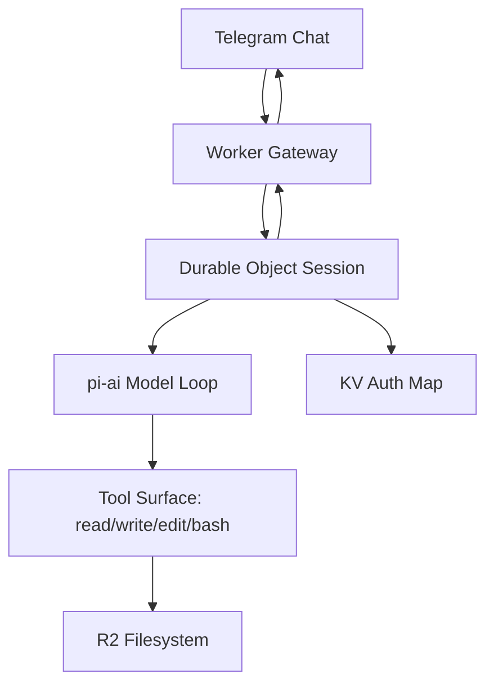

# dreclaw

`dreclaw` is my personal AI assistant, inspired by OpenClaw, built Cloudflare-first.

v0 is Worker-native: Telegram ingress, Durable Object session runtime, model/tool loop in Workers, and R2/KV-backed persistence.

## v0 Scope

- Telegram private chat-only, single-user (me)
- Commands: `/status`, `/reset`
- Core tools: `read`, `write`, `edit`, `bash` (via just-bash)
- R2-backed filesystem for files, memories, and saved scripts
- Provider-agnostic auth map in KV (hot-cached in Durable Object)
- No Sandbox/container dependency in v0

## Architecture (High-level)



- Worker verifies Telegram requests and routes updates.
- Durable Object serializes turns and keeps hot auth cache.
- Model loop runs in Worker and drives tool calls.
- Files/memory/scripts persist in R2.
- Auth credentials persist separately in KV.

## Setup

### Prereqs

- Cloudflare account
- Telegram bot
- Node.js and Wrangler CLI

### Environment

Copy `.env.example` to `.env` and fill values.

### Deploy

Use route from `.env` (keeps route out of repo config):

```bash
set -a; source .env; set +a
pnpm dlx wrangler deploy --route "${CF_WORKER_ROUTE}"
```

## Usage

- Message the bot in a private Telegram chat.
- `/status` shows runtime/session/auth readiness.
- `/reset` clears current session context.

## Persistence model

- Filesystem root of truth is R2.
- Memories are markdown files in R2.
- Saved scripts are stored and run from R2.

## Auth model

- Provider credentials are stored as a provider map in KV.
- Runtime resolves provider dynamically from selected model.
- Token refresh updates DO cache and writes through to KV.
- `/status` reports readiness only (no secrets).

## Security

See `docs/security.md`.

## Future plans

- Telegram `/model` selector
- Semantic memory (AI Search / Vectorize)
- OpenClaw node compatibility layer (post-v0)
